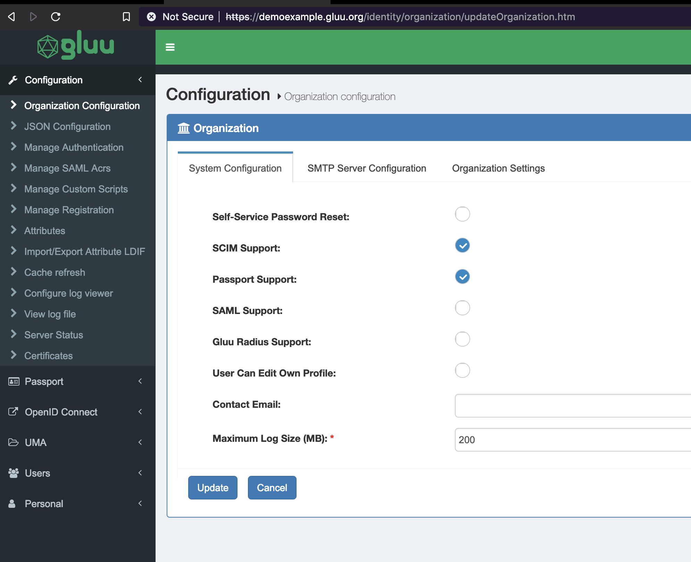
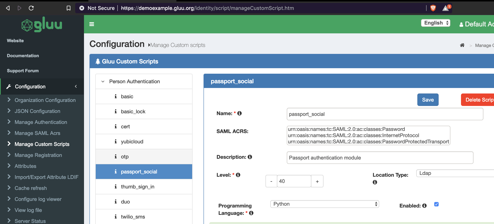
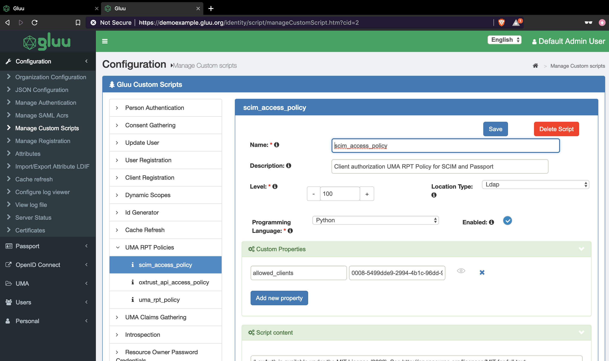

**Note**:  
For minikube, Specs used to test the charts are. 3GB RAM and 40GB memory.

## Gluu Server

[Gluu server](https://www.google.com) is an open-source IAM server that sync backend identities, leverage external IDPs, and achieve SSO, 2FA and more.

## TL;DR;

`helm install beta/gluu`

## Introduction

This chart bootstraps a Gluu Server deployment on a kubernetes cluster using Helm package manager.  
It also packages other components/services that make up Gluu Server.

## Prerequisites

- kubernetes 1.5+ 
- PV provisioner support int the underlying infreastructure

## installing the chart

To install the chart with the release name `my-release`:

`$ helm install --name my-release`

The command deploys Gluu Server on kubernetes cluster in the default configuration. The [configuration](https://github.com/mirr_254/gluu-server-helm/tree/medit-charts#configuration) section lists the parameters that can be configured during installation.

## Uninstalling the Chart

To uninstall/delete the `my-release` deployment:

`$ helm delete my-release`

If during installation the release was not defined, released is checked by running `$ helm ls` the deleted using the previous command and the default release name.

## Configuration

|       Parameter              |      Description                |Default                             |
|------------------------------|---------------------------------|------------------------------------|
| `global.namespace`           | namespace in which to deploy    | `default`                          |
|                                the server                                                           |
| `global.serviceName`         | ldap service name. Used to      | `opendj`                           |
|                              | connect other services to ldap  |                                    |
| `global.nginxIp`             | DNS IP address to be used       | `192.168.99.100`                   |
| `global.oxAuthServiceName`   | `oxauth` service name - should  |  `oxauth`                          |
|                              | not be changed                  |                                    |
|`global.oxTrustSeriveName`    | `oxtrust` service name - should | `oxtrust`                          |
|                              | not be changed                  |                                    |
| `global.domain`              | DNS domain name                 | `demoexample.gluu.org`             |
| `global.gluuLdapUrl`         | wrends/ldap server url. Service |  `opendj:1636`                     |
|                              | name of opendj server - should  |                                    |
|                              | not be changed                  |                                    |
| `global.gluuMaxFraction`     | Controls how much of total RAM  |  `1`                               |
|                              | is up for grabs in containers   |                                    |
|                              | running Java apps               |                                    |
| `global.configAdapterName`   | The config backend adapter      | `kubernetes`                       |
| `global.configSecretAdapter` | The secrets adapter             | `kubernetes`                       |
| `config.enabled`             | Either to install config chart  | `true`                             |
|                              | or not.                         |                                    |
| `config.orgName`             | Organisation Name               | `Gluu`                             |
| `config.email`               | Email to be registered with ssl | `support@gluu.org`                 |
| `config.adminPass`           | Admin password to log in to     | `P@ssw0rd`                         |
|                              | the UI                          |                                    |
| `config.domain`              | FQDN                            | `demoexample.gluu.org`             |
| `config.countryCode`         | Country code of where the Org   |                                    |
|                              | is located                      | `US`                               |
| `config.state`               | State                           | `UT`                               |
| `config.ldapType`            | Type of LDAP server to use.     | `opendj`                           |
| `oxauth.enabled`             | Whether to allow installation   |                                    |
|                              | of oxauth subchart. Should be   |                                    |
|                              | left as true                    |                                    |
| `opendj.enabled`             | Allow installation of ldap      | `true`                             |
|                              | Should left as true             |                                    |
| `opendj.gluuCacheType`       | Which type of cache to use.     |  `NATIVE_PERSISTENCE`              |
|                              | 2 options `REDIS` or            |                                    |
|                              | `NATIVE_PERSISTENCE`            |                                    |
|                              | If `REDIS` is used redis chart  |                                    |
|                              | must be enabled in              |                                    |
|                              | `gluuRedisEnabled` config       |                                    |
| `opendj.gluuRedisEnabled`    | Used if cache type is redis     | `false`                            |
| `redis.enabled`              | Whether to allow installation   | `false`                            |
|                              | of redis chart.                 |                                    |
| `shared-shib.enabled`        | Allow installation of shared    | `true`                             |
|                              | volumes. They are shared        |                                    |
|                              | between `oxtrust` and           |                                    |
|                              | `oxshibboleth` services.        |                                    |
| `oxtrust.enabled`            | Allow installation of oxtrust   |  `true`                            |
| `nginx.enabled`              | Allow installation of nginx.    |  `true`                            |
|                              | Should be allowed unless another|                                    |
|                              | nginx is being deployed         |                                    |
| `oxshibboleth.enabled`       | Allow oxshibboleth installation | `false`                            |
| `oxpassport.enabled`         | Allow oxpassport installation   | `false`                            |
| `key-rotation.enabled`       | Allow key rotation              | `false`                            |
| `cr-rotate.enabled`          | Allow cache rotation deployment | `false`                            |
| `radius.enabled`             | Enabled radius installation     | `false`                            |

## Instruction on how to different services

The recommended way to install the chart with custom values is to specify a `values.yaml` file with the requireed values. 

!!! Tip The default [values.yaml](https://github.com/mirr254/gluu-server-helm/blob/nginx-chart/values.yaml)

### Passport

Because by default `oxpassport` is diasbled and needs to configured before it can be used. There are 2 different ways to enabled oxpassport.
- Method 1: Setting `oxpassport.enabled` to `true` before installation then configuring it on the UI. Kubernetes will restart the pod untill the it detects that passport has been enabled. To enable it on the UI follow these instructions.

1. Login to the UI and navigate to `Configuration` -> `Organization Configuration` -> `System Configuration` and check `Scim Support` and `Passport Support` the click `Update` button on the bottom left.

2. Navigate to `Configuration` -> `Manage Custom Scripts` -> `Person Authentication` -> `passport_social`. Check enabled and click `Save` at the top right of the screen.


3. Navigate to `Configuration` -> `Manage Custom Scripts` -> `UMA RPT Policies` -> `scim_access_policy`. Enable it by checking the box as shown in the image below.


- Method 2: Installing the required services. Enabling installation of `oxpassport` and upgrading helm installation through,  
`helm upgrade --install RELEASE-NAME .` then following the above instructions.

### Redis

To enable usage of Redis change the following values.

```
opendj:
  enabled: true
  # options REDIS/NATIVE_PERSISTENCE
  gluuCacheType: REDIS
  # options true/false : must be enabled if cache type is REDIS
  gluuRedisEnabled: true

# redis should be enabled only when cacheType is REDIS
redis:
  enabled: true

tags:
  redis: true
```

Note: `redis.enabled` will always override the value in `tags.redis`

### Other optional services

Other optional services like `key-rotation`, `cr-rotation` ... are enabled by by setting their coresponding values to true.  
For example, to enable `cr-rotate` use  
```
cr-rotate:
  enabled: true

```